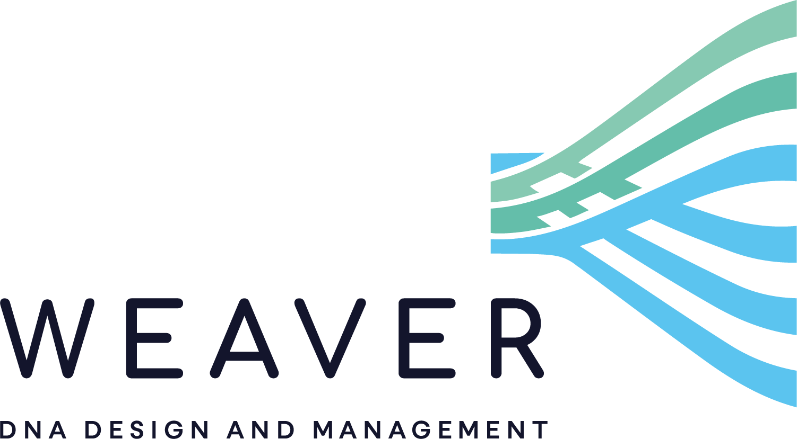

# About

Weaver is an open source web app for DNA design and management.

Django + React dev.

## Demo

Visit our [Demo site](https://weaver-demo.meristem.cl/)!

Credentials:
|User|Password  |
|--|--|
| root | pass |

## Web service

Coming soon!

## Local installation

### Clone repo
Clone repo:

`git clone https://github.com/Meristembio/Weaver`

### Pre-requisites
Make sure you are running python > 3.6. To check your python version run:

`python -v`

Install following packages via python package installer (pip):

`pip3 install django-mathfilters django-shortuuidfield django-multiselectfield Bio plotly pandas pyblastbio more_itertools bs4`

### Running
Enter project folder:

`cd Weaver/Weaver`

Run the server:

`python3 manage.py runserver`

Access local server : [http://127.0.0.1:8000/](http://127.0.0.1:8000/)

Default super user credentials:
|User|Password|
|--|--|
| root | pass |

## Creating objects
Almost all objects can be created and edited from front-end, except the following that can only be edited from [admin site](http://127.0.0.1:8000/admin/):
- Groups & Users from AUTHENTICATION AND AUTHORIZATION
- Boxs, Locations & Strains from INVENTORY

## React modules
- [Assembly wizard](https://github.com/Meristembio/assembly_wizard)
- [L0 Designer](https://github.com/Meristembio/l0d)
- [Plasmids table](https://github.com/Meristembio/plasmids_table)
- [Stocks table](https://github.com/Meristembio/stocks_table)